# 复借G卡模型报告

生成日期：2026-07-01

## Summary（新版模型 vs G卡V6）

- 口径：新版模型（model_score） vs 旧版全客群模型（G卡V6）；分客群表仅为切片效果，不含分客群专属模型对比。
- 更新日期：2026-07-01；指标来源：当前 run 已注册 train/evaluation artifacts。
- 详情导航：模型描述、模型效果-每月效果、模型效果-模型sloping、模型稳定性、重要变量。

### 一、结论摘要

| 项目 | 摘要 |
| --- | --- |
| 核心结论 | OOT-OOS 全客群：G卡V7 KS 0.719 vs G卡V6 0.716，提升 0.3 个百分点；AUC 0.930 vs G卡V6 0.930，提升 0.0 个百分点。 |
| 对比对象 | G卡V6 作为旧版全客群模型；其余历史版本仍保留在明细 sheet 中供追溯。 |
| 解释边界 | 本页只聚焦 30天发起标签的 AUC/KS、OOS 月度表现、分客群切片、sloping、PSI；MOB/金额风险不是本页验收主口径。 |

### 二、模型与样本口径

| 项目 | 内容 |
| --- | --- |
| 标签字段 | ftr_30d_ord_flag |
| Y定义 | 观察日后30天内是否发起订单 |
| 训练/验证/OOS | DEV / DEV-OOS / DEV-OOS、OOT、OOT-OOS |
| 算法 | lightgbm |
| 入模特征数 | 500 |
| 对比对象 | G卡V7 model_score vs 旧版全客群 G卡V6 |
| Best iteration | 322 |
| Valid AUC / KS | 0.933 / 0.719 |

### 三、整体效果对比

整体效果对比 AUC
| 样本 | 样本数 | G卡V7 AUC | G卡V6 AUC | AUC提升 |
| --- | --- | --- | --- | --- |
| DEV | 183739 | 0.952 | 0.937 | 0.015 |
| DEV-OOS | 183480 | 0.933 | 0.934 | -0.001 |
| OOT | 61173 | 0.935 | 0.936 | -0.001 |
| OOT-OOS | 61351 | 0.930 | 0.930 | 0.000 |

整体效果对比 KS
| 样本 | 样本数 | G卡V7 KS | G卡V6 KS | KS提升 |
| --- | --- | --- | --- | --- |
| DEV | 183739 | 0.762 | 0.731 | 0.031 |
| DEV-OOS | 183480 | 0.719 | 0.720 | -0.001 |
| OOT | 61173 | 0.734 | 0.734 | 0.000 |
| OOT-OOS | 61351 | 0.719 | 0.716 | 0.003 |

### 四、OOT-OOS 分客群切片效果

> 分客群结果是效果切片，不代表已训练老户次新/流失户专属模型。

OOT-OOS 分客群切片 AUC
| 客群 | 样本数 | 30天发起率 | G卡V7 AUC | G卡V6 AUC | AUC提升 |
| --- | --- | --- | --- | --- | --- |
| 全客群 | 61351 | 0.145 | 0.930 | 0.930 | 0.000 |
| 老户次新 | 19104 | 0.409 | 0.792 | 0.792 | 0.000 |
| 老户 | 16850 | 0.422 | 0.797 | 0.797 | -0.000 |
| 次新 | 2254 | 0.314 | 0.732 | 0.728 | 0.003 |
| 流失户 | 42247 | 0.025 | 0.899 | 0.902 | -0.003 |

OOT-OOS 分客群切片 KS
| 客群 | 样本数 | 30天发起率 | G卡V7 KS | G卡V6 KS | KS提升 |
| --- | --- | --- | --- | --- | --- |
| 全客群 | 61351 | 0.145 | 0.719 | 0.716 | 0.003 |
| 老户次新 | 19104 | 0.409 | 0.437 | 0.436 | 0.001 |
| 老户 | 16850 | 0.422 | 0.445 | 0.441 | 0.004 |
| 次新 | 2254 | 0.314 | 0.350 | 0.344 | 0.006 |
| 流失户 | 42247 | 0.025 | 0.650 | 0.651 | -0.000 |

### 五、OOS 按月效果

OOS 按月 AUC
| 样本月份 | 样本数 | 30天发起率 | G卡V7 AUC | G卡V6 AUC | AUC提升 |
| --- | --- | --- | --- | --- | --- |
| 2025-06 DEV-OOS | 30491 | 0.189 | 0.927 | 0.929 | -0.002 |
| 2025-07 DEV-OOS | 30523 | 0.184 | 0.931 | 0.931 | -0.000 |
| 2025-08 DEV-OOS | 30405 | 0.187 | 0.939 | 0.939 | -0.001 |
| 2025-09 DEV-OOS | 30645 | 0.170 | 0.934 | 0.934 | -0.000 |
| 2025-10 DEV-OOS | 30663 | 0.159 | 0.932 | 0.933 | -0.001 |
| 2025-11 DEV-OOS | 30753 | 0.152 | 0.933 | 0.934 | -0.001 |
| 2025-12 OOT-OOS | 30606 | 0.150 | 0.931 | 0.931 | 0.001 |
| 2026-01 OOT-OOS | 30745 | 0.140 | 0.928 | 0.929 | -0.001 |

OOS 按月 KS
| 样本月份 | 样本数 | 30天发起率 | G卡V7 KS | G卡V6 KS | KS提升 |
| --- | --- | --- | --- | --- | --- |
| 2025-06 DEV-OOS | 30491 | 0.189 | 0.707 | 0.708 | -0.000 |
| 2025-07 DEV-OOS | 30523 | 0.184 | 0.716 | 0.716 | 0.000 |
| 2025-08 DEV-OOS | 30405 | 0.187 | 0.734 | 0.733 | 0.001 |
| 2025-09 DEV-OOS | 30645 | 0.170 | 0.722 | 0.720 | 0.001 |
| 2025-10 DEV-OOS | 30663 | 0.159 | 0.717 | 0.725 | -0.008 |
| 2025-11 DEV-OOS | 30753 | 0.152 | 0.725 | 0.721 | 0.004 |
| 2025-12 OOT-OOS | 30606 | 0.150 | 0.719 | 0.713 | 0.006 |
| 2026-01 OOT-OOS | 30745 | 0.140 | 0.720 | 0.719 | 0.000 |

### 六、Sloping 高分10%表现

| 客群 | G卡V7 高分10%发起率 | G卡V6高分10%发起率 | 发起率提升 | G卡V7 累计lift | G卡V6累计lift |
| --- | --- | --- | --- | --- | --- |
| 全客群 | 0.798 | 0.772 | 0.025 | 1.000 | 1.000 |
| 老户次新 | 0.933 | 0.907 | 0.026 | 1.000 | 1.000 |
| 流失户 | 0.167 | 0.160 | 0.007 | 1.000 | 1.000 |

### 七、模型稳定性

> PSI 为 G卡V7 分数月度汇总；分箱明细（base/current 占比 + PSI component）见下表。

| 月份 | G卡V7 PSI | G卡V7 样本数 | G卡V6 PSI | G卡V6 样本数 |
| --- | --- | --- | --- | --- |
| 2025-06 | 0.000 | 60987 | 0.000 | 60987 |
| 2025-07 | 0.004 | 60999 | 0.004 | 60999 |
| 2025-08 | 0.008 | 61035 | 0.009 | 61035 |
| 2025-09 | 0.020 | 61200 | 0.021 | 61200 |
| 2025-10 | 0.029 | 61423 | 0.031 | 61423 |
| 2025-11 | 0.037 | 61575 | 0.037 | 61575 |
| 2025-12 | 0.039 | 61187 | 0.038 | 61187 |
| 2026-01 | 0.052 | 61337 | 0.051 | 61337 |

分箱 PSI 明细（基线月 vs 最新月，按分箱看 PSI 贡献）
| 版本 | 分箱 | 基线占比(2025-06) | 当期占比(2026-01) | PSI贡献 |
| --- | --- | --- | --- | --- |
| G卡V7 | 0 | 0.094 | 0.099 | 0.000 |
| G卡V7 | 1 | 0.086 | 0.105 | 0.004 |
| G卡V7 | 2 | 0.083 | 0.112 | 0.009 |
| G卡V7 | 3 | 0.082 | 0.116 | 0.011 |
| G卡V7 | 4 | 0.095 | 0.105 | 0.001 |
| G卡V7 | 5 | 0.102 | 0.098 | 0.000 |
| G卡V7 | 6 | 0.110 | 0.097 | 0.002 |
| G卡V7 | 7 | 0.114 | 0.096 | 0.003 |
| G卡V7 | 8 | 0.114 | 0.094 | 0.004 |
| G卡V7 | 9 | 0.119 | 0.078 | 0.017 |
| G卡V6 | 0 | 0.095 | 0.103 | 0.001 |
| G卡V6 | 1 | 0.081 | 0.109 | 0.008 |
| G卡V6 | 2 | 0.083 | 0.112 | 0.009 |
| G卡V6 | 3 | 0.085 | 0.112 | 0.007 |
| G卡V6 | 4 | 0.102 | 0.105 | 0.000 |
| G卡V6 | 5 | 0.099 | 0.099 | 0.000 |
| G卡V6 | 6 | 0.108 | 0.093 | 0.002 |
| G卡V6 | 7 | 0.112 | 0.096 | 0.002 |
| G卡V6 | 8 | 0.118 | 0.093 | 0.006 |
| G卡V6 | 9 | 0.118 | 0.079 | 0.016 |

### 八、Top 10 重要变量

> 变量明细与 WOE 图见【重要变量】和【Top变量WOE】。

| index | varname | desc | gain | gain占比 | 累计占比 | split |
| --- | --- | --- | --- | --- | --- | --- |
| 1 | d180_apl_ord_days_cnt | 近180天_订单发起天数(去重) | 390325.557 | 0.345 | 0.345 | 113 |
| 2 | first_day_diff_event_result_1_all | first_day_diff_event_result_1_all | 200988.714 | 0.177 | 0.522 | 186 |
| 3 | d360_apl_ord_ddf_mdl_ord_crt_dte_min | 近360天_发起订单距评分日的时间间隔_最小 | 74347.560 | 0.066 | 0.588 | 212 |
| 4 | his_360_day_csh_apl_ord_cnt_his_rto | 近12月历史CASH订单总数/总订单数 | 72331.487 | 0.064 | 0.652 | 81 |
| 5 | d30_d60_apl_ord_cnt_rat | 近30天/近60天_发起订单数_的比例 | 52955.830 | 0.047 | 0.698 | 10 |
| 6 | d180_apl_ord_days_cnt_all | 近180天_订单发起天数(去重)（所有业务类型口径统计） | 19128.948 | 0.017 | 0.715 | 41 |
| 7 | dau_90d | dau_90d | 14052.768 | 0.012 | 0.728 | 166 |
| 8 | pmt_crd_amt_1m | 近1个月单张银行卡最大扣款金额 | 11614.072 | 0.010 | 0.738 | 41 |
| 9 | pmt_crd_amt_3m | 近3个月单张银行卡最大扣款金额 | 8446.183 | 0.007 | 0.745 | 32 |
| 10 | cnt_avg_ord_span_30d | cnt_平均订单间隔_30d | 8369.491 | 0.007 | 0.753 | 53 |

> 证据提示：本页不补造缺失结果；当前 run audit 仍应以 `rmw run audit` 输出为准。

## 一、模型描述

- 模型目标：预测配置标签字段 `ftr_30d_ord_flag`。
- 建模样本：训练集 DEV，验证集 DEV-OOS，OOS DEV-OOS、OOT、OOT-OOS。
- 算法：lightgbm；最终入模变量 500 个；best iteration 322。
- 验证集效果：AUC 0.933，KS 0.719，Train/Valid AUC gap 0.019。

## 二、变量筛选过程

| 步骤 | 筛选方法 | 剩余变量个数 |
| --- | --- | --- |
| 1 | 原始候选变量总数 | 2837 |
| 2 | Feather观察样本可用特征 | 2563 |
| 3 | 分表基础预筛：缺失率、相关性、IV（全表，local feather） | 1773 |
| 4 | 稳定性筛选：DEV vs OOT PSI（全表，local feather） | 1773 |
| 5 | 全局相关性去重：按单变量AUC保留更强特征 | 1773 |
| 6 | 随机数重要性筛选（feature-select-v2兼容）：单随机列对比 split/gain 并剔除尾部重要性特征 | 1773 |
| 7 | 空标签重要性筛选：保留显著高于空标签分布的特征 | 1022 |
| 8 | 选取Top500特征入模 | 500 |

- 训练预处理保留 500/500 个变量；剔除 0 个变量。

## 三、核心效果与历史版本对比

- OOT-OOS：G卡V7 AUC 0.930、KS 0.719；相对 G卡V2 KS 提升 0.018，相对 G卡V4 KS 提升 0.031，相对 G卡V5 KS 提升 0.026，相对 G卡V6 KS 提升 0.003。

| final_flag | n_samples | positive | bad_rate | model_score_auc | model_score_ks |
| --- | --- | --- | --- | --- | --- |
| DEV | 183739 | 28148 | 0.153 | 0.952 | 0.762 |
| DEV-OOS | 183480 | 31827 | 0.173 | 0.933 | 0.719 |
| OOT | 61173 | 7895 | 0.129 | 0.935 | 0.734 |
| OOT-OOS | 61351 | 8889 | 0.145 | 0.930 | 0.719 |

| final_flag | model_score_auc | model_score_ks | 相对V2版本提升 | 相对V4版本提升 | 相对V5版本提升 | 相对V6版本提升 |
| --- | --- | --- | --- | --- | --- | --- |
| DEV | 0.952 | 0.762 | 0.048 | 0.053 | 0.052 | 0.031 |
| DEV-OOS | 0.933 | 0.719 | 0.015 | 0.025 | 0.018 | -0.001 |
| OOT | 0.935 | 0.734 | 0.016 | 0.024 | 0.019 | 0.000 |
| OOT-OOS | 0.930 | 0.719 | 0.018 | 0.031 | 0.026 | 0.003 |

## 四、模型效果

1、每月效果（OOS）

| 序号 | 结论 |
| --- | --- |
| 1 | （1）在 OOT-OOS 样本上老户次新客群上，G卡V7全客群模型 KS 0.437；对比G卡V5 KS 0.402 提升3.5个百分点，对比G卡V6 KS 0.436 提升0.1个百分点。 |
| 2 | （2）在 OOT-OOS 样本上流失户客群上，G卡V7全客群模型 KS 0.650；对比G卡V5 KS 0.632 提升1.9个百分点，较G卡V6 KS 0.651 低0.0个百分点。 |
| 3 | （3）在 OOT-OOS 样本上全客群整体看，G卡V7 KS 0.719，对比G卡V5 KS 0.693 提升2.6个百分点，对比G卡V6 KS 0.716 提升0.3个百分点。 |
| 4 | （4）当前 run 未注册老户次新/流失户专属模型得分，无法复刻历史文档中的“分客群建模 KS”对比；本摘要仅比较G卡V7全客群模型与已注册的 G卡V5/G卡V6 历史版本。 |

全客群 by月效果（KS）
| 样本月份 | G卡V7 | G卡V6 |
| --- | --- | --- |
| 2025-06 DEV-OOS | 0.707 | 0.708 |
| 2025-07 DEV-OOS | 0.716 | 0.716 |
| 2025-08 DEV-OOS | 0.734 | 0.733 |
| 2025-09 DEV-OOS | 0.722 | 0.720 |
| 2025-10 DEV-OOS | 0.717 | 0.725 |
| 2025-11 DEV-OOS | 0.725 | 0.721 |
| 2025-12 OOT-OOS | 0.719 | 0.713 |
| 2026-01 OOT-OOS | 0.720 | 0.719 |

全客群 by月效果（AUC）
| 样本月份 | G卡V7 | G卡V6 |
| --- | --- | --- |
| 2025-06 DEV-OOS | 0.927 | 0.929 |
| 2025-07 DEV-OOS | 0.931 | 0.931 |
| 2025-08 DEV-OOS | 0.939 | 0.939 |
| 2025-09 DEV-OOS | 0.934 | 0.934 |
| 2025-10 DEV-OOS | 0.932 | 0.933 |
| 2025-11 DEV-OOS | 0.933 | 0.934 |
| 2025-12 OOT-OOS | 0.931 | 0.931 |
| 2026-01 OOT-OOS | 0.928 | 0.929 |

老户次新整体效果（KS）
| 样本 | G卡V7 | G卡V6 |
| --- | --- | --- |
| DEV | 0.569 | 0.480 |
| DEV-OOS | 0.485 | 0.485 |
| OOT | 0.450 | 0.454 |
| OOT-OOS | 0.437 | 0.436 |

老户次新整体效果（AUC）
| 样本 | G卡V7 | G卡V6 |
| --- | --- | --- |
| DEV | 0.867 | 0.818 |
| DEV-OOS | 0.820 | 0.820 |
| OOT | 0.797 | 0.799 |
| OOT-OOS | 0.792 | 0.792 |

老户整体效果（KS）
| 样本 | G卡V7 | G卡V6 |
| --- | --- | --- |
| DEV | 0.573 | 0.484 |
| DEV-OOS | 0.488 | 0.489 |
| OOT | 0.455 | 0.457 |
| OOT-OOS | 0.445 | 0.441 |

老户整体效果（AUC）
| 样本 | G卡V7 | G卡V6 |
| --- | --- | --- |
| DEV | 0.869 | 0.820 |
| DEV-OOS | 0.822 | 0.823 |
| OOT | 0.799 | 0.802 |
| OOT-OOS | 0.797 | 0.797 |

次新整体效果（KS）
| 样本 | G卡V7 | G卡V6 |
| --- | --- | --- |
| DEV | 0.487 | 0.393 |
| DEV-OOS | 0.398 | 0.385 |
| OOT | 0.369 | 0.379 |
| OOT-OOS | 0.350 | 0.344 |

次新整体效果（AUC）
| 样本 | G卡V7 | G卡V6 |
| --- | --- | --- |
| DEV | 0.817 | 0.763 |
| DEV-OOS | 0.762 | 0.758 |
| OOT | 0.737 | 0.730 |
| OOT-OOS | 0.732 | 0.728 |

流失户整体效果（KS）
| 样本 | G卡V7 | G卡V6 |
| --- | --- | --- |
| DEV | 0.680 | 0.629 |
| DEV-OOS | 0.623 | 0.630 |
| OOT | 0.601 | 0.618 |
| OOT-OOS | 0.650 | 0.651 |

流失户整体效果（AUC）
| 样本 | G卡V7 | G卡V6 |
| --- | --- | --- |
| DEV | 0.917 | 0.891 |
| DEV-OOS | 0.886 | 0.896 |
| OOT | 0.878 | 0.888 |
| OOT-OOS | 0.899 | 0.902 |

2、模型sloping

全样本 30天发起：在全客群效果 - G卡V7
| 分组 | 占比 | 累计发起率 | 累计lift | 剩余发起率 | 剩余lift |
| --- | --- | --- | --- | --- | --- |
| 001 | 10.0% | 0.001 | 0.007 | 0.174 | 1.110 |
| 002 | 10.0% | 0.002 | 0.010 | 0.196 | 1.248 |
| 003 | 10.0% | 0.002 | 0.014 | 0.223 | 1.423 |
| 004 | 10.0% | 0.003 | 0.019 | 0.259 | 1.654 |
| 005 | 10.0% | 0.004 | 0.028 | 0.309 | 1.972 |
| 006 | 10.0% | 0.008 | 0.050 | 0.380 | 2.425 |
| 007 | 10.0% | 0.018 | 0.117 | 0.480 | 3.060 |
| 008 | 10.0% | 0.042 | 0.265 | 0.618 | 3.941 |
| 009 | 10.0% | 0.086 | 0.546 | 0.798 | 5.089 |
| 010 | 10.0% | 0.157 | 1.000 | 0.000 | 0.000 |

全样本 30天发起：在全客群效果 - G卡V6
| 分组 | 占比 | 累计发起率 | 累计lift | 剩余发起率 | 剩余lift |
| --- | --- | --- | --- | --- | --- |
| 001 | 10.0% | 0.001 | 0.005 | 0.174 | 1.111 |
| 002 | 10.0% | 0.001 | 0.007 | 0.196 | 1.248 |
| 003 | 10.0% | 0.002 | 0.012 | 0.223 | 1.423 |
| 004 | 10.0% | 0.003 | 0.018 | 0.259 | 1.654 |
| 005 | 10.0% | 0.005 | 0.030 | 0.309 | 1.970 |
| 006 | 10.0% | 0.009 | 0.055 | 0.379 | 2.417 |
| 007 | 10.0% | 0.020 | 0.128 | 0.476 | 3.036 |
| 008 | 10.0% | 0.045 | 0.285 | 0.605 | 3.859 |
| 009 | 10.0% | 0.088 | 0.564 | 0.772 | 4.928 |
| 010 | 10.0% | 0.157 | 1.000 | 0.000 | 0.000 |

全样本 30天发起：在老户次新效果 - G卡V7
| 分组 | 占比 | 累计发起率 | 累计lift | 剩余发起率 | 剩余lift |
| --- | --- | --- | --- | --- | --- |
| 001 | 10.0% | 0.061 | 0.143 | 0.464 | 1.095 |
| 002 | 10.0% | 0.088 | 0.207 | 0.508 | 1.198 |
| 003 | 10.0% | 0.115 | 0.271 | 0.557 | 1.312 |
| 004 | 10.0% | 0.146 | 0.344 | 0.610 | 1.438 |
| 005 | 10.0% | 0.180 | 0.423 | 0.669 | 1.577 |
| 006 | 10.0% | 0.220 | 0.518 | 0.731 | 1.723 |
| 007 | 10.0% | 0.265 | 0.624 | 0.796 | 1.876 |
| 008 | 10.0% | 0.314 | 0.741 | 0.863 | 2.035 |
| 009 | 10.0% | 0.368 | 0.867 | 0.933 | 2.200 |
| 010 | 10.0% | 0.424 | 1.000 | 0.000 | 0.000 |

全样本 30天发起：在老户次新效果 - G卡V6
| 分组 | 占比 | 累计发起率 | 累计lift | 剩余发起率 | 剩余lift |
| --- | --- | --- | --- | --- | --- |
| 001 | 10.0% | 0.069 | 0.163 | 0.463 | 1.093 |
| 002 | 10.0% | 0.100 | 0.235 | 0.505 | 1.191 |
| 003 | 10.0% | 0.129 | 0.303 | 0.551 | 1.299 |
| 004 | 10.0% | 0.161 | 0.379 | 0.600 | 1.414 |
| 005 | 10.0% | 0.195 | 0.460 | 0.653 | 1.540 |
| 006 | 10.0% | 0.234 | 0.551 | 0.710 | 1.673 |
| 007 | 10.0% | 0.275 | 0.649 | 0.771 | 1.819 |
| 008 | 10.0% | 0.321 | 0.757 | 0.836 | 1.972 |
| 009 | 10.0% | 0.370 | 0.873 | 0.907 | 2.139 |
| 010 | 10.0% | 0.424 | 1.000 | 0.000 | 0.000 |

全样本 30天发起：在流失户效果 - G卡V7
| 分组 | 占比 | 累计发起率 | 累计lift | 剩余发起率 | 剩余lift |
| --- | --- | --- | --- | --- | --- |
| 001 | 10.0% | 0.001 | 0.026 | 0.027 | 1.108 |
| 002 | 10.0% | 0.001 | 0.052 | 0.030 | 1.237 |
| 003 | 10.0% | 0.001 | 0.063 | 0.034 | 1.402 |
| 004 | 10.0% | 0.002 | 0.081 | 0.039 | 1.613 |
| 005 | 10.0% | 0.002 | 0.102 | 0.045 | 1.898 |
| 006 | 10.0% | 0.003 | 0.126 | 0.055 | 2.311 |
| 007 | 10.0% | 0.004 | 0.163 | 0.071 | 2.953 |
| 008 | 10.0% | 0.005 | 0.219 | 0.099 | 4.123 |
| 009 | 10.0% | 0.008 | 0.337 | 0.167 | 6.969 |
| 010 | 10.0% | 0.024 | 1.000 | 0.000 | 0.000 |

全样本 30天发起：在流失户效果 - G卡V6
| 分组 | 占比 | 累计发起率 | 累计lift | 剩余发起率 | 剩余lift |
| --- | --- | --- | --- | --- | --- |
| 001 | 10.0% | 0.001 | 0.027 | 0.027 | 1.108 |
| 002 | 10.0% | 0.001 | 0.036 | 0.030 | 1.241 |
| 003 | 10.0% | 0.001 | 0.048 | 0.034 | 1.408 |
| 004 | 10.0% | 0.002 | 0.067 | 0.039 | 1.622 |
| 005 | 10.0% | 0.002 | 0.091 | 0.046 | 1.909 |
| 006 | 10.0% | 0.003 | 0.121 | 0.056 | 2.319 |
| 007 | 10.0% | 0.004 | 0.165 | 0.071 | 2.949 |
| 008 | 10.0% | 0.006 | 0.233 | 0.097 | 4.069 |
| 009 | 10.0% | 0.009 | 0.369 | 0.160 | 6.676 |
| 010 | 10.0% | 0.024 | 1.000 | 0.000 | 0.000 |

3、意愿交叉风险（DEV-OOS）

老户 DEV-OOS 意愿 x 资产评级

占比

老户 - 占比 - G卡V7
| 意愿 | 1 | 2 | 3 | 4 | 5 | 6 | 7 | 合计 |
| --- | --- | --- | --- | --- | --- | --- | --- | --- |
| 低意愿 | 0.011 | 0.055 | 0.089 | 0.101 | 0.014 | 0.052 | 0.011 | 0.333 |
| 中意愿 | 0.014 | 0.051 | 0.064 | 0.087 | 0.015 | 0.076 | 0.026 | 0.333 |
| 高意愿 | 0.013 | 0.045 | 0.063 | 0.089 | 0.015 | 0.079 | 0.030 | 0.333 |
| 合计 | 0.038 | 0.152 | 0.216 | 0.277 | 0.044 | 0.207 | 0.066 | 1.000 |

30天发起率

老户 - 30天发起率 - G卡V7
| 意愿 | 1 | 2 | 3 | 4 | 5 | 6 | 7 | 合计 |
| --- | --- | --- | --- | --- | --- | --- | --- | --- |
| 低意愿 | 0.158 | 0.141 | 0.142 | 0.150 | 0.150 | 0.158 | 0.156 | 0.148 |
| 中意愿 | 0.416 | 0.414 | 0.423 | 0.418 | 0.458 | 0.454 | 0.441 | 0.430 |
| 高意愿 | 0.758 | 0.796 | 0.793 | 0.806 | 0.782 | 0.775 | 0.780 | 0.789 |
| 合计 | 0.454 | 0.429 | 0.414 | 0.444 | 0.473 | 0.502 | 0.548 | 0.456 |

新增订单3期金额逾期率

老户 - 新增订单3期金额逾期率 - G卡V7
| 意愿 | 1 | 2 | 3 | 4 | 5 | 6 | 7 | 合计 |
| --- | --- | --- | --- | --- | --- | --- | --- | --- |
| 低意愿 | 0.032 | 0.009 | 0.040 | 0.036 | 0.014 | 0.036 | 0.000 | 0.027 |
| 中意愿 | 0.021 | 0.023 | 0.041 | 0.045 | 0.025 | 0.050 | 0.087 | 0.033 |
| 高意愿 | 0.032 | 0.037 | 0.051 | 0.058 | 0.098 | 0.093 | 0.041 | 0.049 |
| 合计 | 0.029 | 0.031 | 0.048 | 0.053 | 0.067 | 0.078 | 0.052 | 0.043 |

流失户 DEV-OOS 意愿 x 资产评级

占比

流失户 - 占比 - G卡V7
| 意愿 | 1 | 2 | 3 | 4 | 5 | 6 | 7 | 合计 |
| --- | --- | --- | --- | --- | --- | --- | --- | --- |
| 低意愿 | 0.000 | 0.000 | 0.002 | 0.005 | 0.012 | 0.148 | 0.166 | 0.333 |
| 中意愿 | 0.001 | 0.004 | 0.015 | 0.018 | 0.055 | 0.183 | 0.057 | 0.333 |
| 高意愿 | 0.015 | 0.036 | 0.053 | 0.034 | 0.075 | 0.103 | 0.016 | 0.333 |
| 合计 | 0.016 | 0.041 | 0.070 | 0.057 | 0.143 | 0.434 | 0.239 | 1.000 |

30天发起率

流失户 - 30天发起率 - G卡V7
| 意愿 | 1 | 2 | 3 | 4 | 5 | 6 | 7 | 合计 |
| --- | --- | --- | --- | --- | --- | --- | --- | --- |
| 低意愿 | 0.000 | 0.000 | 0.004 | 0.000 | 0.003 | 0.002 | 0.002 | 0.002 |
| 中意愿 | 0.000 | 0.008 | 0.007 | 0.006 | 0.006 | 0.007 | 0.008 | 0.007 |
| 高意愿 | 0.091 | 0.075 | 0.060 | 0.052 | 0.057 | 0.075 | 0.140 | 0.070 |
| 合计 | 0.086 | 0.067 | 0.047 | 0.033 | 0.033 | 0.022 | 0.013 | 0.026 |

新增订单3期金额逾期率

流失户 - 新增订单3期金额逾期率 - G卡V7
| 意愿 | 1 | 2 | 3 | 4 | 5 | 6 | 7 | 合计 |
| --- | --- | --- | --- | --- | --- | --- | --- | --- |
| 低意愿 | 0.000 | 0.000 | 0.000 | 0.000 | 0.000 | 0.000 | 0.000 | 0.000 |
| 中意愿 | 0.000 | 0.000 | 0.017 | 0.000 | 0.171 | 0.173 | 0.029 | 0.126 |
| 高意愿 | 0.039 | 0.051 | 0.040 | 0.018 | 0.049 | 0.049 | 0.000 | 0.042 |
| 合计 | 0.039 | 0.051 | 0.036 | 0.018 | 0.063 | 0.076 | 0.003 | 0.047 |

## 五、模型稳定性

- G卡V7 PSI 最高的 5 个观测如下：
| month | psi | n_samples | score_column |
| --- | --- | --- | --- |
| 2026-01 | 0.052 | 61337 | model_score |
| 2025-12 | 0.039 | 61187 | model_score |
| 2025-11 | 0.037 | 61575 | model_score |
| 2025-10 | 0.029 | 61423 | model_score |
| 2025-09 | 0.020 | 61200 | model_score |

## 六、重要变量

| feature | 中文名 | gain | split |
| --- | --- | --- | --- |
| d180_apl_ord_days_cnt | 近180天_订单发起天数(去重) | 390325.557 | 113 |
| first_day_diff_event_result_1_all |  | 200988.714 | 186 |
| d360_apl_ord_ddf_mdl_ord_crt_dte_min | 近360天_发起订单距评分日的时间间隔_最小 | 74347.560 | 212 |
| his_360_day_csh_apl_ord_cnt_his_rto | 近12月历史CASH订单总数/总订单数 | 72331.487 | 81 |
| d30_d60_apl_ord_cnt_rat | 近30天/近60天_发起订单数_的比例 | 52955.830 | 10 |
| d180_apl_ord_days_cnt_all | 近180天_订单发起天数(去重)（所有业务类型口径统计） | 19128.948 | 41 |
| dau_90d |  | 14052.768 | 166 |
| pmt_crd_amt_1m | 近1个月单张银行卡最大扣款金额 | 11614.072 | 41 |
| pmt_crd_amt_3m | 近3个月单张银行卡最大扣款金额 | 8446.183 | 32 |
| cnt_avg_ord_span_30d | cnt_平均订单间隔_30d | 8369.491 | 53 |
| ddf_lst_app_str_tim_to_mdl_tim_sec | 设备启动到评分日时间-秒 | 6892.132 | 278 |
| d30_apl_ord_days_cnt | 近30天_订单发起天数(去重) | 6468.948 | 82 |
| stg_pln_max_prc_amt_12m_ftr | 未来近12个月的最大应还本金金额 | 5926.201 | 19 |
| clk_cnt_14d |  | 4640.890 | 108 |
| ord_apl_avg_prc_amt_720_day_per_mth | 近720天发起动支订单的动支总金额_单月平均 | 4588.928 | 62 |
> 中文名缺失说明：在重要变量 Top15 中，以下变量未在变量字典中匹配到中文名：first_day_diff_event_result_1_all、dau_90d、clk_cnt_14d。

## 七、Top变量WOE

- 以下展示 Top20 入模变量的真实 WOE 图；完整分箱数据见 Excel sheet `Top变量WOE` 和 `woe_top_features/woe_top20_summary.csv`。
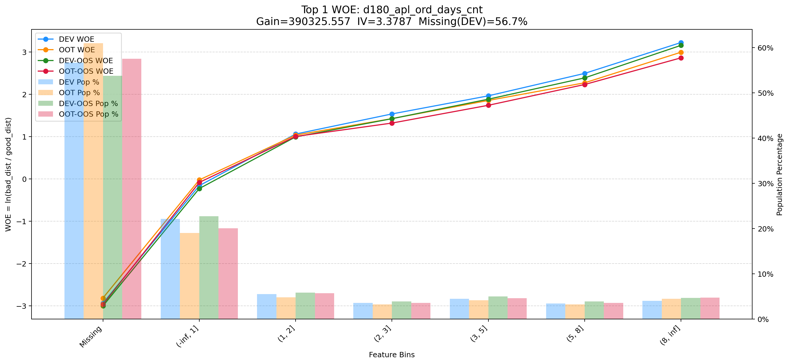
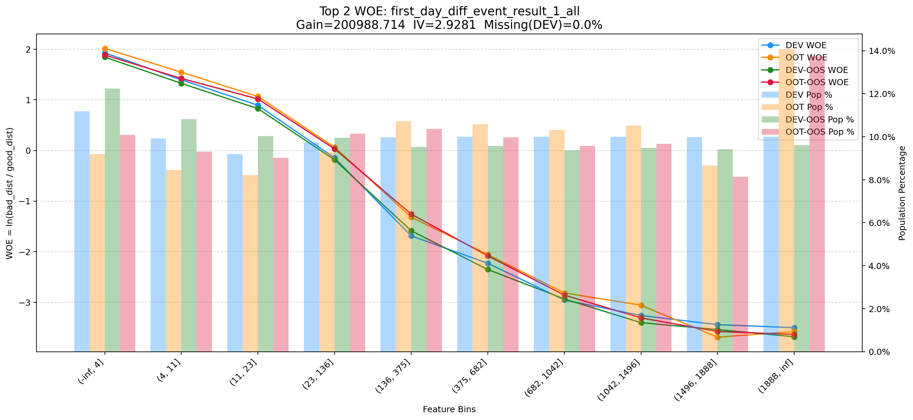
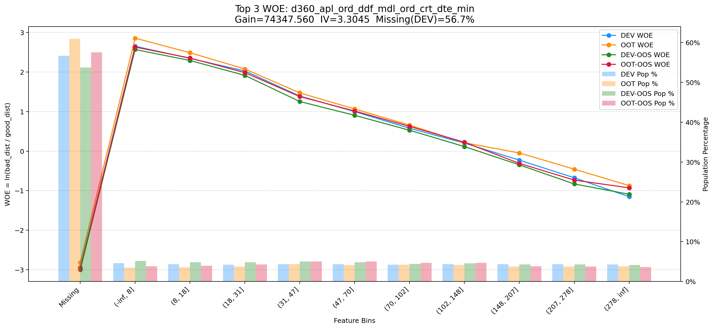
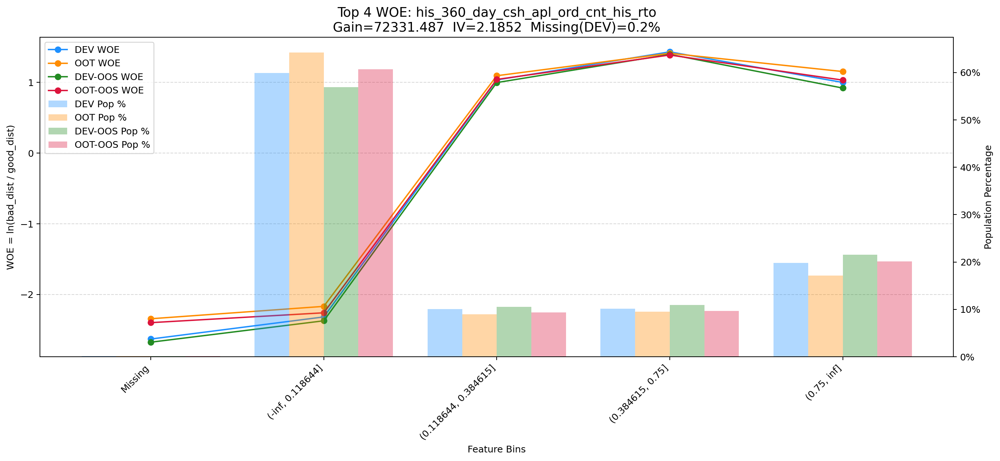
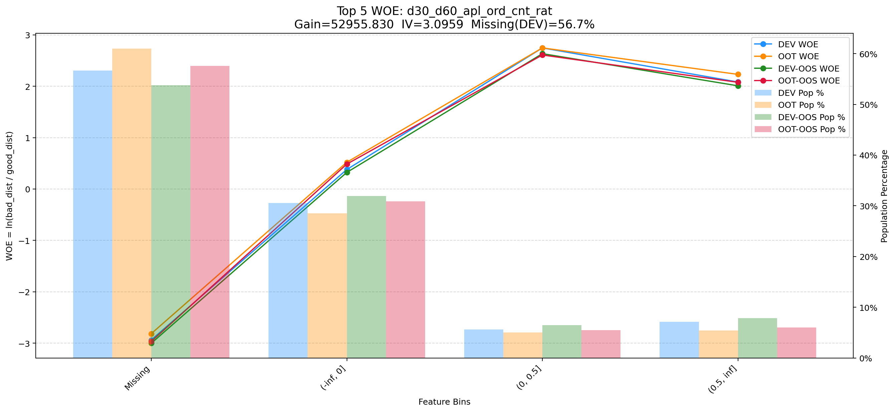
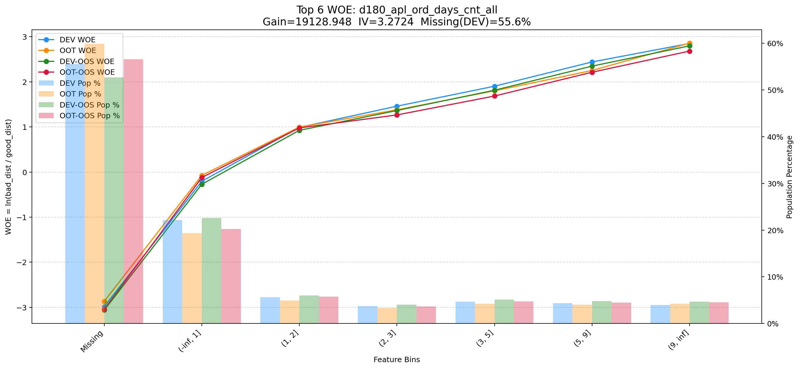
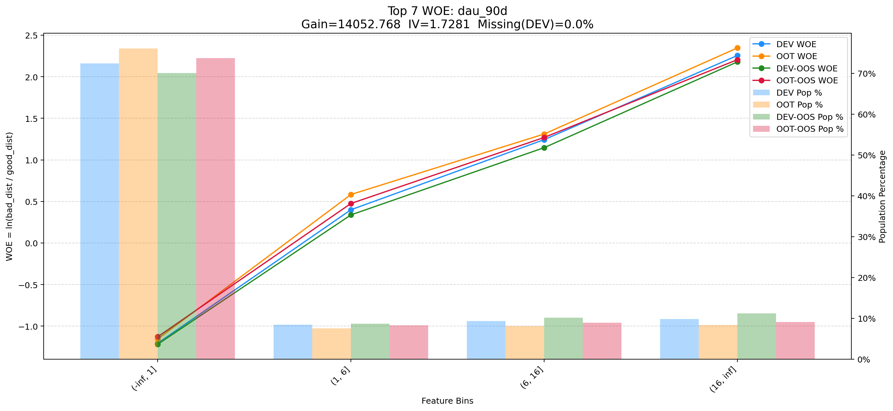
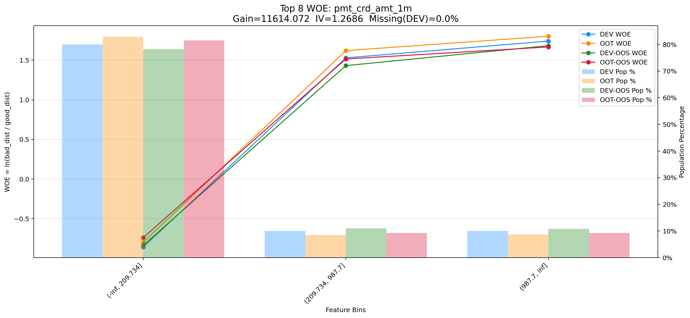
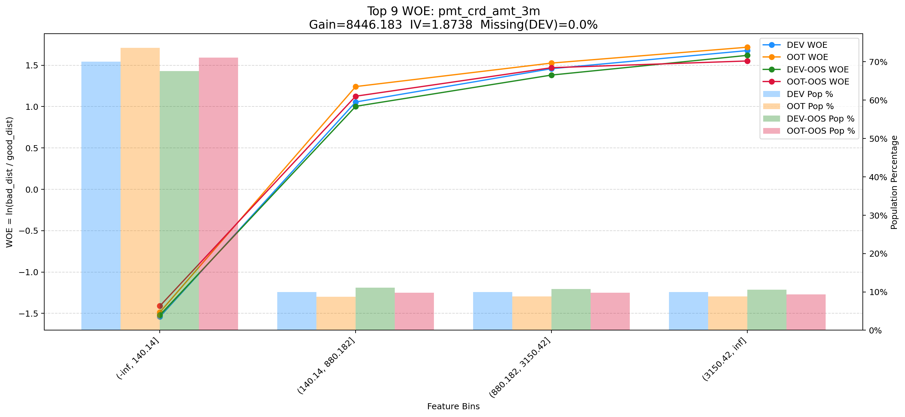
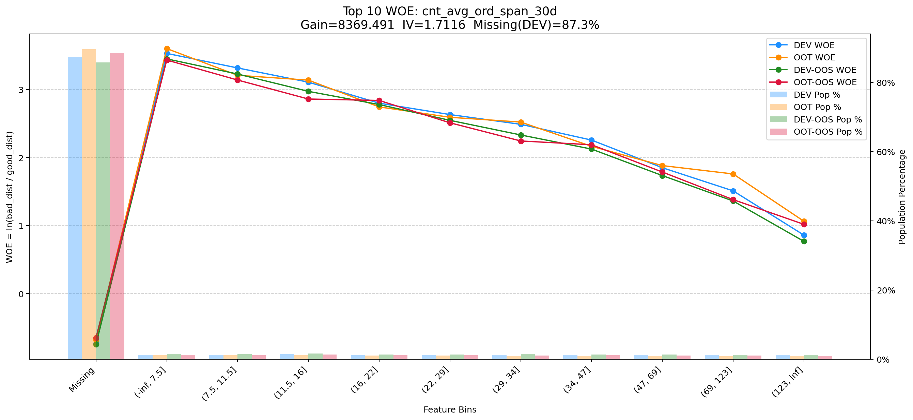
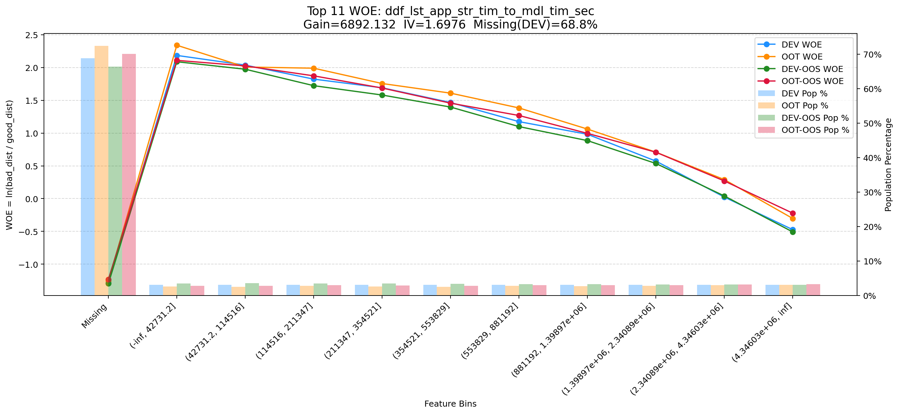
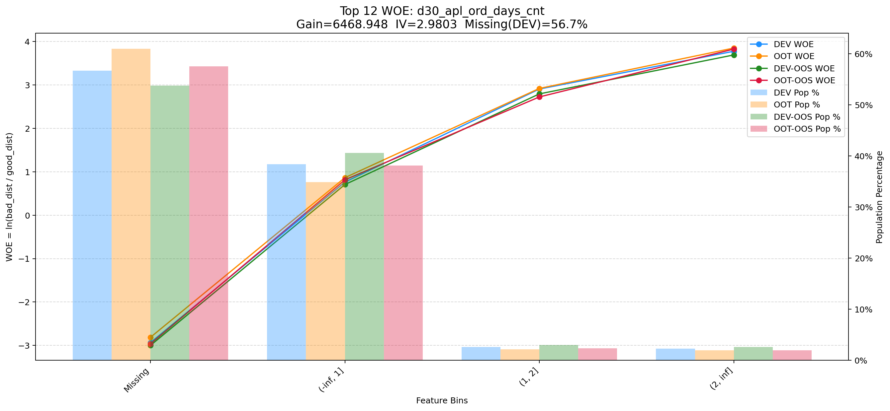
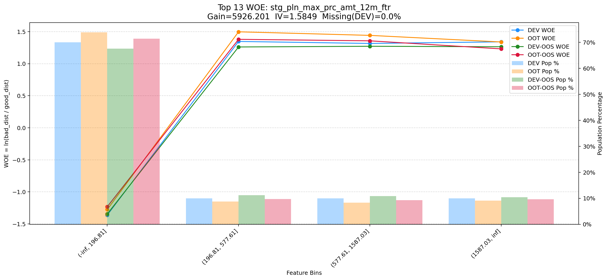
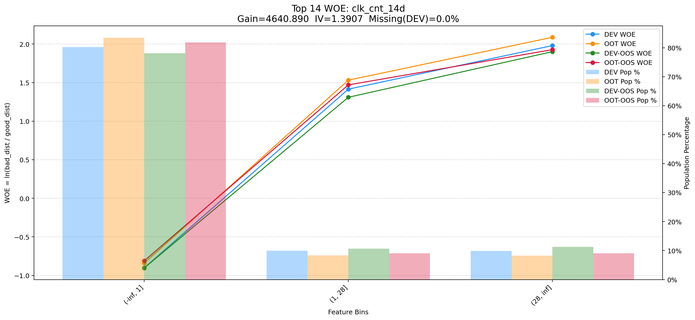
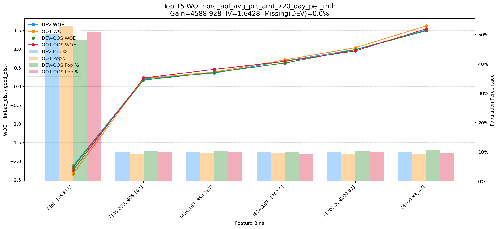
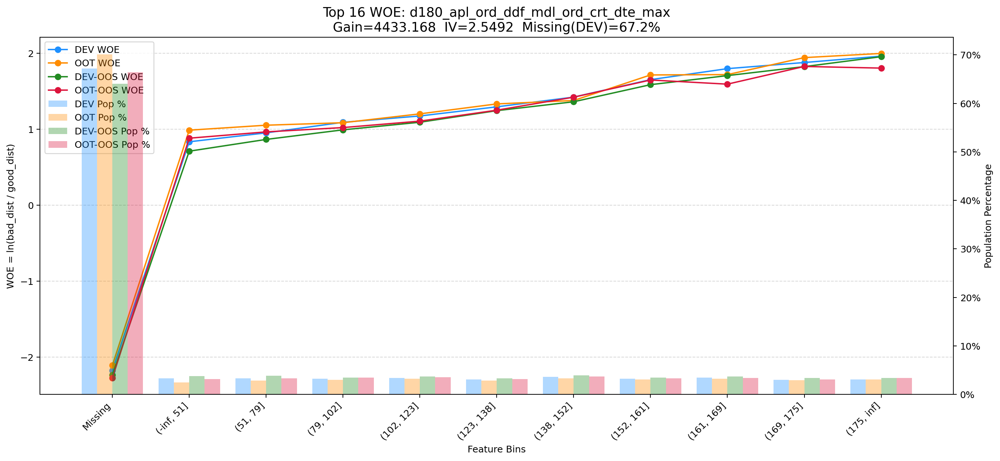
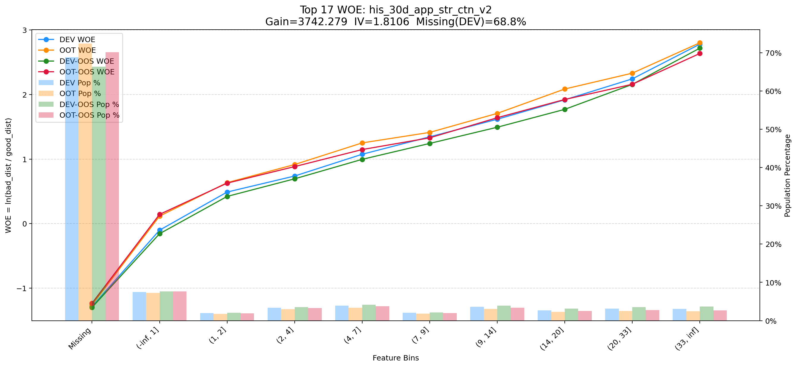
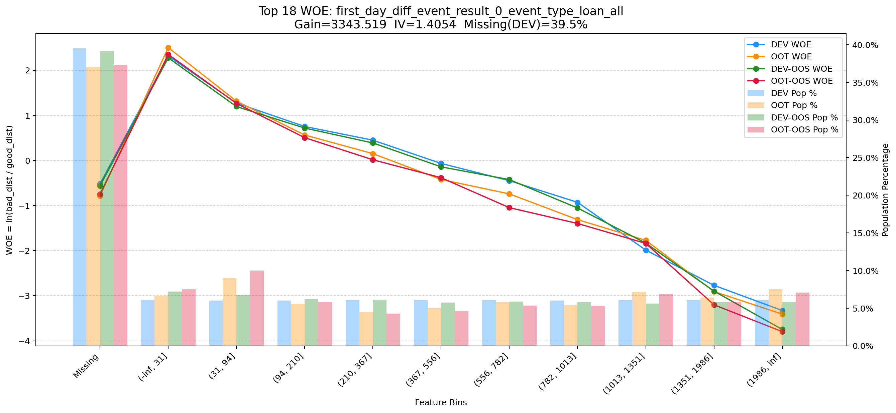
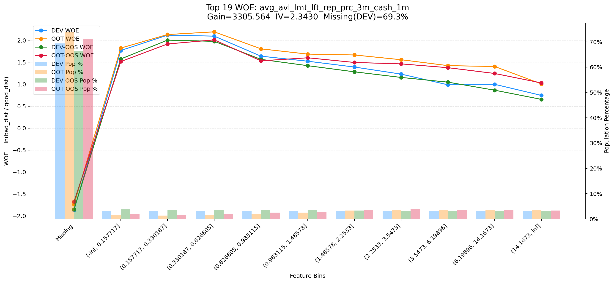
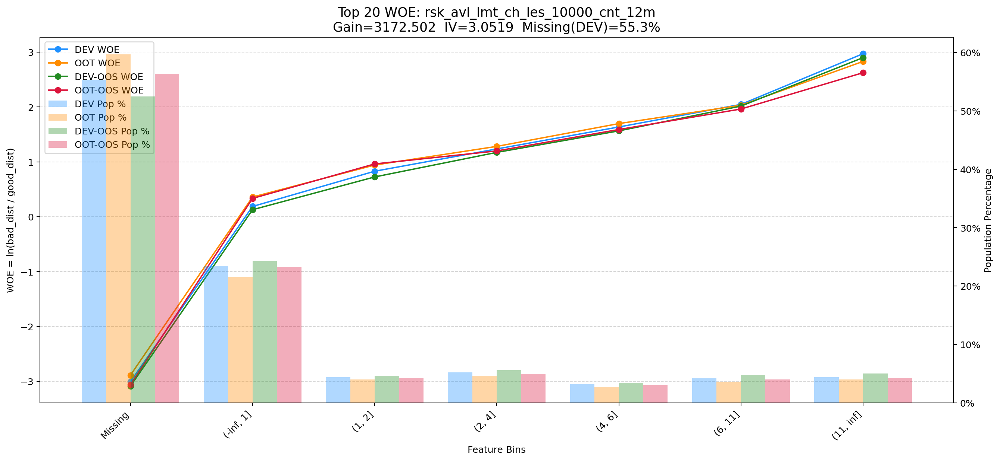
> 中文名缺失说明：在Top变量WOE 展示图中，以下变量未在变量字典中匹配到中文名：first_day_diff_event_result_1_all、dau_90d、clk_cnt_14d、first_day_diff_event_result_0_event_type_loan_all。

## 八、待补充事项

- 当前仍不可补齐：变量分布/分箱图、变量中文描述与业务标签、MOB1/MOB3 历史风险精确定义；这些需要原始特征值、业务字典或未来期还款表现数据。
- 详见 `model_report_missing_results.md`。
